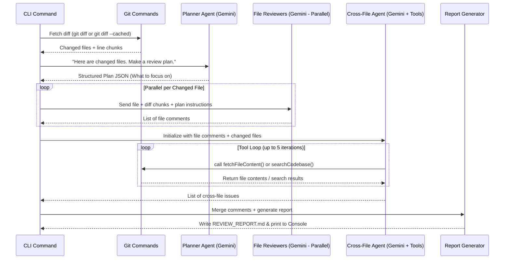

# Project Plan: AI Code Reviewer CLI (Gemini-Powered)

This document contains the complete, end-to-end architecture, reasoning logic, and step-by-step roadmap for building the AI Code Reviewer CLI.

---

## 1. Overview & Objectives

The goal is to build a local, command-line tool that reviews staged or unstaged git changes, offering deep, senior-engineer-level mentorship on your code.

### Core Goals:
1. **Mentorship Focus**: Review feedback should not just say "change X to Y." It should explain the *why*, the potential consequences if left unfixed (security, performance, readability), and provide a clean code patch.
2. **100% Gemini-Powered**: To keep costs near-zero, we will use **Google Gemini 2.0 Flash** for all LLM steps (Planning, File Review, and Cross-File Reasoning with Tools).
3. **Double-Report Presentation**:
   * **Console Output**: A clean, color-coded terminal printout for quick reading.
   * **Markdown Report**: A detailed, educational file (`REVIEW_REPORT.md`) created in your workspace containing deep explanations, side-by-side style patches, and lessons learned.

---

## 2. Review Presentation Format: "Senior Engineer Mentor"

To make the review educational and easy to digest, each review finding will follow a structured schema:

```json
{
  "filePath": "src/controllers/auth.ts",
  "line": 45,
  "severity": "HIGH",
  "category": "Security / Logic / Performance / Style",
  "title": "Unexpired Session Tokens",
  "problem": "Briefly state what is wrong with the current implementation.",
  "whyItMatters": "Educational explanation of the background theory (e.g., token hijacking risk, memory leak reasons).",
  "consequences": "What happens in production if this is merged (e.g., 'Compromised admin tokens will remain active indefinitely').",
  "suggestedPatch": "The exact code replacement.",
  "confidence": 0.95
}
```

This JSON will be rendered into a beautiful Markdown report (`REVIEW_REPORT.md`):

---

### Example Markdown Output (`REVIEW_REPORT.md` preview)

#### 🔴 `HIGH` | Security: Unexpired Session Tokens
* **File**: [`src/controllers/auth.ts`](file:///d:/Kai_AI/src/controllers/auth.ts#L45)
* **Problem**: The JWT token does not include an `expiresIn` configuration.
* **Why It Matters**: By default, JSON Web Tokens without an expiration claim (`exp`) remain valid forever. If a malicious actor intercepts this token, they gain permanent access to the user's account. Standard security compliance (like OWASP) requires session tokens to expire.
* **Consequences**: Compromised user sessions cannot be revoked or terminated naturally, leading to vulnerability to replay attacks.

**Suggested Solution:**
```diff
- const token = jwt.sign({ userId }, JWT_SECRET);
+ const token = jwt.sign({ userId }, JWT_SECRET, { expiresIn: '24h' });
```

---

## 3. The Multi-Agent Pipeline

To review code deeply and catch cross-file bugs, we divide the work into four sequential modules:



---

## 4. Step-by-Step Implementation Roadmap

We will implement the project in 6 clear steps:

### Step 1: Project Setup & Git Hook Foundations
* Set up a TypeScript project in `d:/Kai_AI`.
* Create `package.json` with dependencies: Vercel AI SDK (`ai`), Google GenAI Provider (`@ai-sdk/google`), `dotenv` (for API keys), `zod`, and TypeScript developer utilities.
* Implement a git wrapper (`git.ts`) that runs:
  * `git status` to see what is changed.
  * `git diff` to get unstaged changes.
  * `git diff --cached` to get staged changes.
  * Parser logic to break the raw diff output into a clean list of files and lines.

### Step 2: Context Builder & Metadata Extraction
* Write a script that scans the directory to map out the codebase context:
  * Detect language (TypeScript, Python, Go).
  * Read dependencies (`package.json`, `requirements.txt`) to understand the stack.
  * List the file directory structure so the AI knows where files reside.

### Step 3: Planner and Parallel File Reviewers
* **Planner Agent (`planner.ts`)**: A `generateObject` call using Gemini 2.0 Flash. Outputs a JSON plan mapping files to review scopes (deep review for logic/security, light review for formatting, skip for tests).
* **File Reviewers (`reviewer.ts`)**: Uses `Promise.all` to run Gemini 2.0 Flash calls in parallel. For each changed file, reviews only the lines changed in the diff, respecting the Planner's scope guidelines.

### Step 4: The Cross-File Agent Loop (Gemini + Tools)
* **Cross-File Agent (`crossFile.ts`)**: A `generateText` loop with `maxSteps: 5` using Gemini 2.0 Flash.
* **Tools Defined**:
  1. `fetchFile(path)`: Returns the content of any file in the workspace.
  2. `searchCodebase(query)`: Greps code for occurrences of a function or imports.
  3. `listDirectory(path)`: Lists the files in a folder to check if accompanying files (like migration scripts, test files, or config updates) are present.
* **Persona**: Instruct the agent to look for inconsistencies (e.g. database schema changes where queries were not updated, or public API contract changes with outdated consumers).

### Step 5: Report Presenter (Console + Markdown)
* **Reporter (`reporter.ts`)**:
  * Formats the consolidated comments into a console output using colors (red for High, yellow for Medium, cyan for info).
  * Writes a beautiful markdown report `REVIEW_REPORT.md` in the root directory.
  * Highlights key "Lessons Learned" or educational takeaways at the bottom.

### Step 6: Testing & Optimization
* Test the CLI on dummy projects with seeded bugs (e.g. broken imports, SQL vulnerability, outdated schema query).
* Optimize system prompts to filter out superficial suggestions (like complaining about styling/comments unless critical) to focus purely on engineering excellence.

---

## 5. System Prompts

To guarantee high quality and a senior-mentor tone, the agents will use these prompts:

### File Reviewer Agent Prompt
> "You are a pragmatic, highly experienced Senior Software Architect. Your job is to review the code diff and identify bugs, security vulnerabilities, performance bottlenecks, or poor engineering choices.
>
> CRITICAL RULES:
> 1. Do not complain about style, formatting, or missing comments unless they severely impact readability.
> 2. Be encouraging but direct. Explain the engineering rationale behind every critique.
> 3. Your suggestions must be educational, detailing the root cause of the issue and what consequences it will have if deployed to production.
> 4. Focus on staged diff lines only."

### Cross-File Agent Prompt
> "You are a systems engineer reviewing a changeset. You have a list of file review reports.
>
> Your goal is to find cross-file discrepancies. Look at the changed files and ask yourself:
> * Did they modify a function signature? Check if other files calling it were updated.
> * Did they modify a database model/table? Check if queries, schemas, or migrations in other directories match.
> * Did they add a configuration requirement? Check if the template configurations were updated.
>
> Use your tools (`fetchFile`, `searchCodebase`, `listDirectory`) to inspect files that are NOT in the diff. Iterate until you are confident or hit the execution limit."
