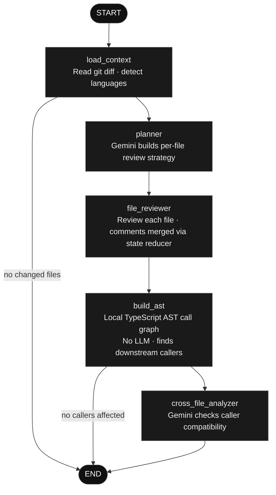

# Code-Sage CLI

An agentic AI code reviewer built on a **LangGraph state machine** and a local **AST call-graph engine**.  
Runs in GitHub Actions to post inline reviews directly onto Pull Request diffs.

---

## Architecture

Code-Sage is implemented as a LangGraph `StateGraph` — a directed agentic execution graph where each node is an isolated stage that reads from and writes to shared typed state. The graph routes conditionally at runtime based on what it discovers.



**What makes this architecture meaningful:**

- **Conditional edges**: The cross-file LLM call only fires if the AST graph finds unmodified callers affected by the change. Empty diffs exit at the first edge. No wasted API calls.
- **State reducer on comments**: Each node appends review findings to shared state independently. `file_reviewer` and `cross_file_analyzer` never overwrite each other.
- **Node isolation**: Each node can fail and retry independently. A failed file review does not abort the cross-file analysis stage.
- **AST runs local**: The call graph is built entirely on-device. The LLM only ever sees the git diff and the 10-line snippets surrounding affected caller sites — no full codebase uploads.

---

## Tech Stack

| Layer | Technology |
| :--- | :--- |
| Agentic Graph | LangGraph `@langchain/langgraph` |
| LLM | Google Gemini via Vercel AI SDK `@ai-sdk/google` |
| AST Parsing | TypeScript Compiler API |
| GitHub Integration | Octokit REST `@octokit/rest` |
| CLI | ora · chalk |
| Schema Validation | Zod |

---

## Usage

### Option A — Run Locally

Review uncommitted changes before pushing. No GitHub required.

**1. Get a free API key** from [Google AI Studio](https://aistudio.google.com/)

**2. Set the key:**
```bash
# macOS / Linux
export GEMINI_API_KEY="your_key_here"

# Windows PowerShell
$env:GEMINI_API_KEY="your_key_here"
```
Or place `GEMINI_API_KEY=your_key_here` in a `.env` file at the project root.

**3. Run:**
```bash
# All uncommitted changes
npx code-sage-cli

# Staged only
npx code-sage-cli --staged

# Unstaged only
npx code-sage-cli --unstaged
```

Findings are printed directly to the terminal — severity level, file, line, problem, consequences, and suggested patch where applicable.

---

### Option B — GitHub Actions (Automated PR Reviews)

Code-Sage posts inline review comments directly onto the Pull Request diff. No configuration file to write manually.

**1. Add your API key to GitHub Secrets**

Go to your repository → **Settings** → **Secrets and variables** → **Actions** → **New repository secret**

- Name: `GEMINI_API_KEY`
- Value: your Gemini API key

**2. Auto-generate the workflow file**

In the root of your repository, run:
```bash
npx code-sage-cli --init
```

This creates `.github/workflows/code-review.yml` with correct permissions and runner config.

**3. Commit and push**
```bash
git add .github/workflows/code-review.yml
git commit -m "ci: add code-sage automated PR review"
git push
```

Every Pull Request opened or updated from this point will automatically trigger Code-Sage. It will run the full agentic pipeline against the PR diff and post findings as inline comments on the changed lines.

---

## CLI Reference

| Flag | Description |
| :--- | :--- |
| *(none)* | Review all uncommitted changes |
| `--staged` | Review staged changes only |
| `--unstaged` | Review unstaged changes only |
| `--init` | Generate the GitHub Actions workflow file |
| `--force` | Bypass the large-file and initial-commit guards |

| Environment Variable | Description |
| :--- | :--- |
| `GEMINI_API_KEY` | Required. Google Gemini API key. |
| `GITHUB_TOKEN` | Required in CI. Provided automatically by GitHub Actions. |
| `GEMINI_PRIMARY_MODEL` | Optional. Override the primary model. Default: `gemini-2.5-flash` |
| `GEMINI_BACKUP_MODEL` | Optional. Override the fallback model. Default: `gemini-2.5-flash-lite` |

---

## Contributing

```bash
git clone https://github.com/Rounak87/Code-Sage-cli.git
cd Code-Sage-cli
npm install
npm run build
npm link
code-sage-cli --staged
```

---

## License

MIT
